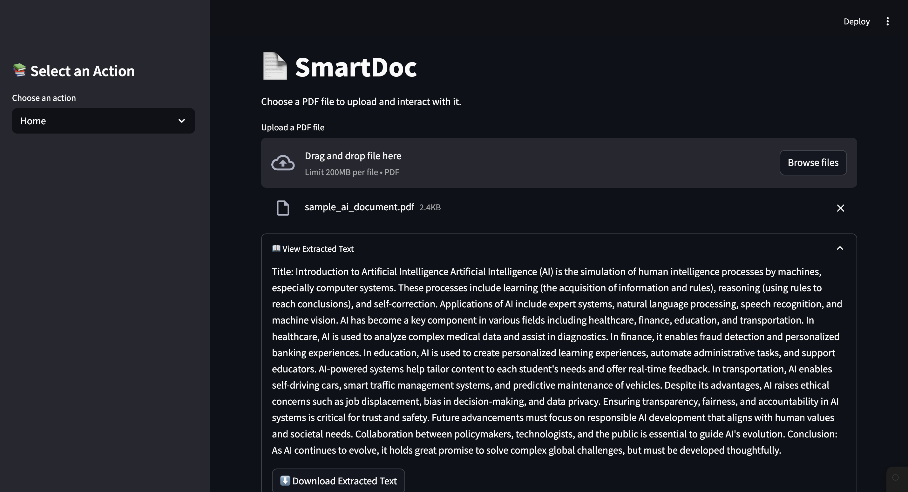
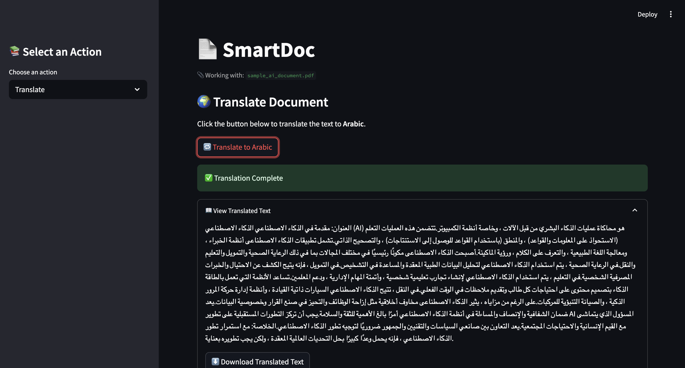
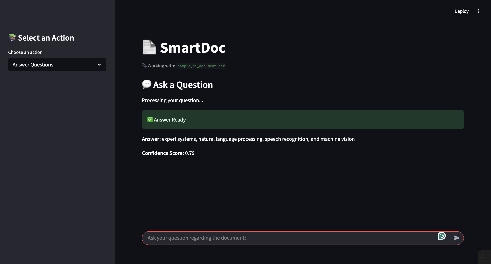
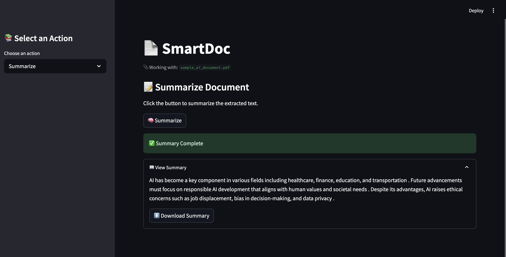

# 📄 SmartDoc: Your AI-Powered Document Assistant

SmartDoc is a user-friendly Streamlit web app that helps you interact intelligently with PDF documents. It allows you to extract text, translate it into Arabic, summarize content, and even ask AI-powered questions — all from your browser.

## Features

- 📄 **Upload PDFs** and extract clean, readable text
- 🌍 **Translate** document text from English to Arabic
- 🧠 **Summarize** large documents using state-of-the-art AI
- 💬 **Ask questions** and get answers from your uploaded content
- 📅 **Download** extracted, translated, or summarized text

## Screenshots

<table>
  <tr>
    <td></td>
    <td></td>
  </tr>
  <tr>
    <td></td>
    <td></td>
  </tr>
</table>

## Tech Stack

- [Python](https://www.python.org/)
- [Streamlit](https://streamlit.io/)
- [HuggingFace Transformers](https://huggingface.co/)
- [Googletrans](https://py-googletrans.readthedocs.io/en/latest/)
- [PyMuPDF (fitz)](https://pymupdf.readthedocs.io/en/latest/)


## ▶️ How to Run

```bash
streamlit run app.py
```

Then open the URL shown in the terminal (usually `http://localhost:8501`) in your browser.

## 📁 Project Structure

```
smartdoc/
├── main.py                 # Main Streamlit app
├── pdf_utils.py           # Text extraction from PDFs
├── translator.py          # English to Arabic translation
├── qa_engine.py           # Question answering using transformers
├── summarizer.py          # Text summarization
└── README.md              # Project documentation
```

## ✅ Requirements

Make sure you have:

- Python 3.7+
- Internet connection (for model downloads and API calls)

## Example Use Cases

- Reading and summarizing academic papers
- Translating research reports
- Interacting with legal documents
- Getting answers from long policy files

## Models Used

- **Question Answering**: `distilbert-base-uncased-distilled-squad`
- **Summarization**: `sshleifer/distilbart-cnn-12-6`
- **Translation**: Google Translate API via `googletrans`


